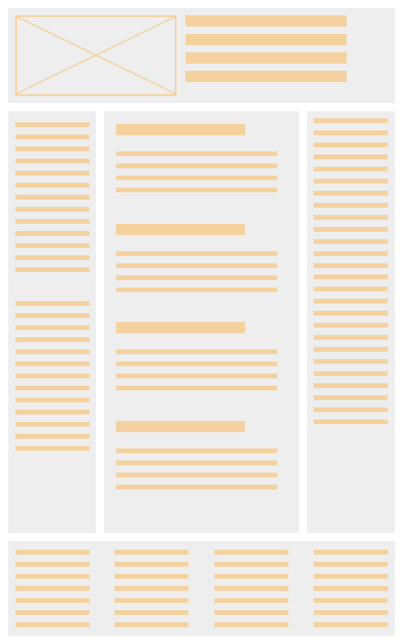
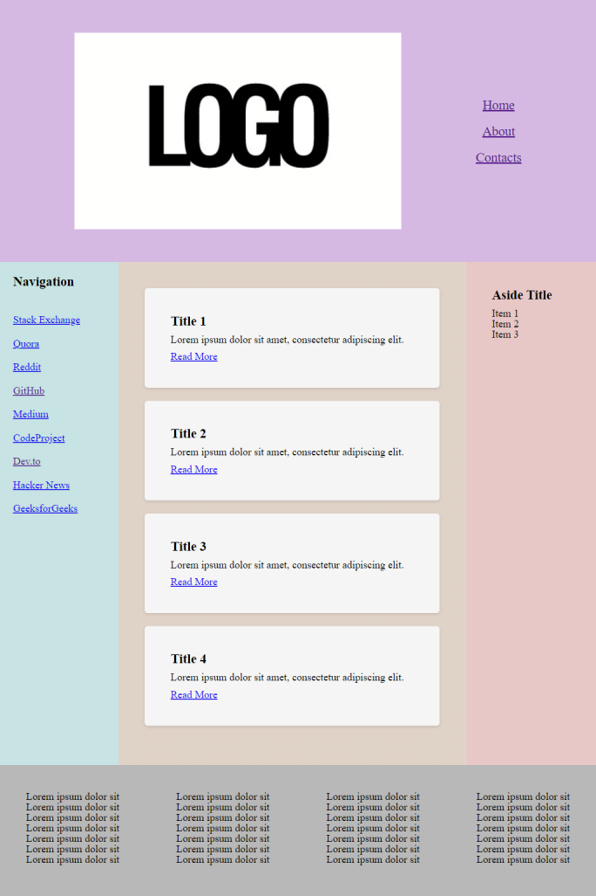

# Курс "JavaScript Developer. Basic" | OTUS

## Домашнее задание - Приложение "Стилизация страницы, позиционирование элементов"

### Описание

Выполнена разметка страницы с использованием семантических тегов. Стилизация выполнена через css файл, загружаемый в сборку Webpack.
Перед применением стилизации выполнен сброс браузерных стилей - в webpack-entry-файл подключен файл reset.css:

```js
import './css/reset.css';
import './css/style.css';
```


Открыть страницу в браузере на GitHub Pages по ссылке: [https://v-nvtsk.github.io/otus-jsbasic-dz20/](https://v-nvtsk.github.io/otus-jsbasic-dz20/)

## Макет

При создании страницы использован условный макет:


## Результат



Сборка проекта выполняется с использованием webpack. Сборку можно выполнить запуском npm скриптов:
  `development` сборка:

  > npm run build:dev

  `production` сборка:

  > npm run build:prod

  запуск локального веб-сервера по адресу http://127.0.0.1:3000 выполняется скриптом:

  > npm start

